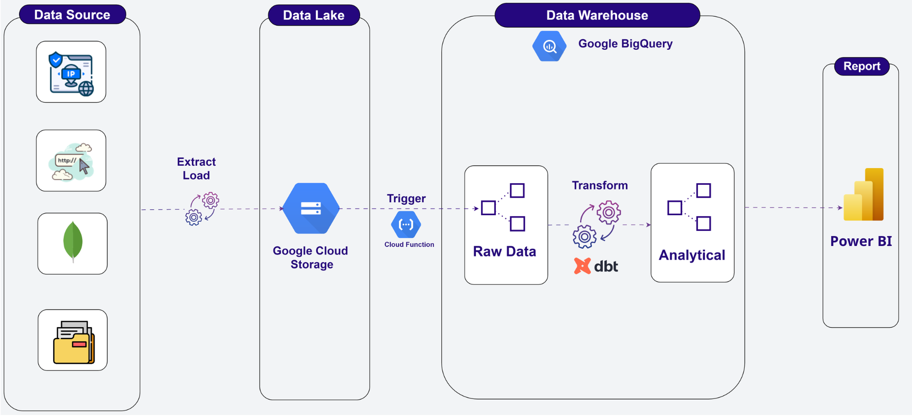
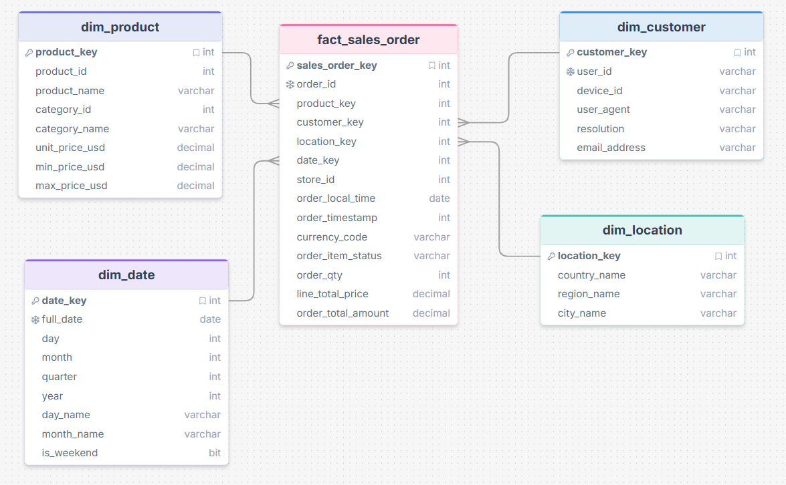
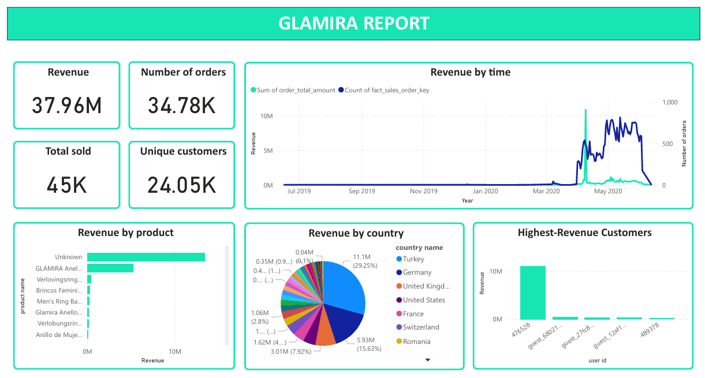

# Glamira User Behavior Pipeline


## Overview 
This project builds an end-to-end data pipeline for **[Glamira](https://www.glamira.vn/)**, a global jewelry e-commerce platform operating across 70+ countries and currencies. The pipeline processes raw user behavior data (41M+ rows) sourced from a static dataset, processes them through a multi-layer architecture, and delivers a clean, analytics-ready Star Schema data warehouse to support business intelligence reporting via Power BI.

The pipeline focuses on `checkout_success` events, enriching order data with product catalog information, IP-based geolocation, and multi-currency normalization to produce unified, trustworthy metrics across Revenue, Orders, Items Sold, and Unique Customers.

## Objectives
- **Collect** raw user behavior data from Glamira's tracking system and store in MongoDB
- **Process** IP geolocation for all unique IPs using ip2location
- **Crawl** product information from Glamira's website for active product catalog
- **Export** raw data from MongoDB to Google Cloud Storage (GCS)
- **Ingest** data from GCS into BigQuery raw layer via automated Cloud Function triggers
- **Transform** data through Staging → Intermediate → Warehouse layers using dbt
- **Validate** data quality at every layer using dbt tests
- **Serve** analytics-ready Star Schema to Power BI dashboards

## Project Structure
```
glamira-pipeline/
│
├── config/                                 # Configuration files
│   ├── __init__.py
│   ├── config.py                          
│   └── connect.py                          # MongoDB connection handlers
│
├── data/                                   # Raw and processed data files
│   ├── raw/                                
│   └── processed/                          
│
├── dbt_pipeline/                           # dbt transformation project
│   ├── models/
│   │   ├── staging/                        # Dedup, clean & standardize
│   │   ├── intermediate/                   # Generate surrogate key
│   │   └── warehouse/                      # Star schema: dim + fact
│   ├── seeds/
│   │   └── exchange_rates.csv              # currencies + store domain mapping
│   ├── macros/
│   ├── tests/
│   ├── dbt_project.yml
│
├── docs/                                   # Project documentation
│
├── etl/                                    # ETL scripts
│   ├── extract/                            # Extract from MongoDB/website 
│   │   └── ...
│   ├── load/                               # Load to MongoDB and GCS 
│   │   └── ...
│   └── transform/                          # Data cleaning & transformation
│       └── ...
│
├── src/                                    # Core source code
│   ├── data/                               # data enrichment & transformation scripts
│   │   └── ...
│   └── utils/                              
│       └── ...
│
├── tests/                                  # Unit and integration tests
│   └── ...
│
├── .env                                    # Environment variables 
├── .gitignore                              # git ignore rules
├── main.py                                 # Pipeline entry point
├── pyproject.toml                          # Poetry project & dependency config
├── poetry.lock
└── README.md
```

## Tech Stack
- **Programming Language**: Python 3.12  
- **Raw Data Storage**: MongoDB 
- **Cloud Platform**: Google Cloud Platform (GCP) - GCS (Storage), BigQuery (DWH), Cloud Functions (event-driven trigger for GCS → BigQuery ingestion)
- **Data Transformation**: dbt (Data Build Tool)
- **Visualization**: Power BI
- **Dependency Management**: Poetry    
- **Version Control**: Github

## Cloud Functions & GCS → BigQuery Pipeline
### Architecture Overview
```
GCS Bucket (raw_glamira_bucket)
    │
    ├── glamira_raw*.jsonl      ──→ Cloud Function: export-glamira-raw   ──→ raw_layer.glamira_raw
    ├── ip_locations*.jsonl     ──→ Cloud Function: export-ip-locations  ──→ raw_layer.ip_locations
    └── product_info*.jsonl     ──→ Cloud Function: export-product-info  ──→ raw_layer.product_info
                                                        │
                                              load_tracking table
                                         (idempotency / dedup guard)
```

Each Cloud Function is triggered automatically via **Eventarc** when a new file is uploaded to the GCS bucket. A shared `load_tracking` table in BigQuery acts as a lock/dedup mechanism to prevent duplicate loads from re-triggered events.

### Cloud Functions
#### 1. `export-glamira-raw`
Loads raw Glamira user behavior events (`.jsonl`) into `raw_layer.glamira_raw`.
**Trigger:** New file uploaded to GCS matching prefix `glamira_raw` and suffix `.jsonl`
**Idempotency:** Uses `MERGE` statement on `load_tracking` to atomically acquire a lock — if the file has already been processed, the function skips with `DUPLICATE_SKIPPED`.

```python
def load_glamira_raw(cloud_event):
    # 1. Parse GCS event (bucket + file_name)
    # 2. Skip if not glamira_raw*.jsonl
    # 3. Try to acquire lock via MERGE on load_tracking
    # 4. If lock acquired → load JSONL from GCS to BigQuery (WRITE_APPEND)
    # 5. Log result: SUCCESS / DUPLICATE_SKIPPED / FAILED
```

**Key config:**
```python
job_config = bigquery.LoadJobConfig(
    source_format=bigquery.SourceFormat.NEWLINE_DELIMITED_JSON,
    write_disposition=bigquery.WriteDisposition.WRITE_APPEND,
    ignore_unknown_values=True,   # tolerates schema evolution
)
```

#### 2. `export-ip-locations`
Loads IP geolocation data (`.jsonl`) into `raw_layer.ip_locations`.
**Trigger:** New file uploaded to GCS matching prefix `ip_locations` and suffix `.jsonl`
**Idempotency:** Checks `load_tracking` via `SELECT COUNT(*)` before loading — marks file as loaded after success via `INSERT`.

```python
def load_ip_locations(cloud_event):
    # 1. Parse GCS event (bucket + file_name)
    # 2. Skip if not ip_locations*.jsonl
    # 3. Check load_tracking → skip if already loaded
    # 4. Load JSONL from GCS to BigQuery (WRITE_APPEND)
    # 5. Mark file as loaded in load_tracking
```

#### 3. `export-product-info`
Loads product catalog data (`.jsonl`) into `raw_layer.product_info`.
**Trigger:** New file uploaded to GCS matching prefix `product_info` and suffix `.jsonl`
**Idempotency:** Same pattern as `export-ip-locations` — check → load → mark.

```python
def load_product_info(cloud_event):
    # 1. Parse GCS event (bucket + file_name)
    # 2. Skip if not product_info*.jsonl
    # 3. Check load_tracking → skip if already loaded
    # 4. Load JSONL from GCS to BigQuery (WRITE_APPEND)
    # 5. Mark file as loaded in load_tracking
```

### Load Tracking Table
A shared deduplication table prevents duplicate BigQuery loads when Cloud Functions are re-triggered (GCS Eventarc can fire multiple times for the same upload).

```sql
-- BigQuery DDL
CREATE TABLE `raw_layer.load_tracking` (
    file_name   STRING    NOT NULL,
    loaded_at   TIMESTAMP NOT NULL
);
```
| Column | Type | Description |
|--------|------|-------------|
| `file_name` | STRING | GCS object name (e.g. `glamira_raw_001.jsonl`) |
| `loaded_at` | TIMESTAMP | Timestamp when file was successfully loaded |

### IAM Service Accounts
| Service Account | Roles | Purpose |
|----------------|-------|---------|
| gcs-uploader | Editor | Used by export scripts (MongoDB/local → GCS) to upload files |
| bigquery-load | BigQuery Data Editor, BigQuery Job User, Eventarc Event Receiver, Storage Object Admin | Used by Cloud Functions to read from GCS and write to BigQuery |
| trigger-bigquery-load | Cloud Run Invoker, Eventarc Event Receiver | Used by Eventarc to invoke Cloud Functions when new files land in GCS |
| dbt-glamira | BigQuery Admin | Used by dbt to run transformation queries across all datasets |

## Data Model
- **Architecture:** Star Schema (Kimball methodology)
- **Fact Table:** `fact_sales_order` — grain: 1 row per product per order
- **Dimension Tables:** `dim_product`, `dim_customer`, `dim_date`, `dim_location`
- **Surrogate Keys:** `FARM_FINGERPRINT` hashing



## Report Sample


## Getting Started
### 1. Clone the repository
```bash
git clone https://github.com/Tbach1203/glamira_user_behavior_pipeline.git
cd glamira_user_behavior_pipeline
```
### 2. Install dependencies
```bash
poetry install
```
### 3. Run commands using Poetry
```bash 
poetry run python -m src.main
```
### 4. DBT 
```bash 
cd dbt_pipeline
dbt build
```
